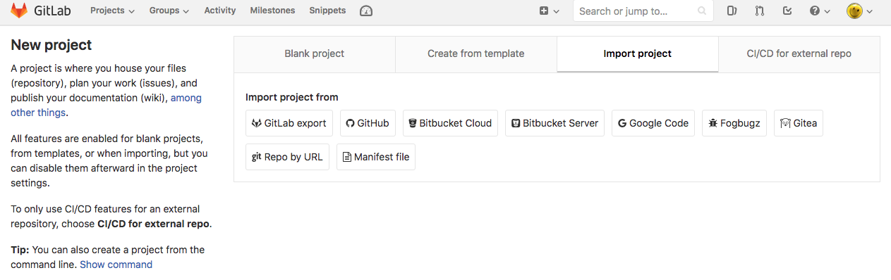

# How to run
1
terraform apply -auto-approve
echo "external_ip:" > ../2_dns_records/terraform_inventory
terraform output | grep mng-ext | awk '{print "  - " $3}'  >> ../2_dns_records/terraform_inventory

2
cd ../2_dns_records
ansible-playbook -D gcdns_record.yml -v

3
docker network create -d overlay traefik_network

eval $(cat .env)
docker stack deploy -c docker.yml etcd
docker stack deploy -c docker.yml traefik


# проект
export GOOGLE_PROJECT=keen-phalanx-223413

# создание
docker-machine create --driver google \
    --google-machine-image https://www.googleapis.com/compute/v1/projects/ubuntu-os-cloud/global/images/family/ubuntu-1604-lts \
    --google-machine-type n1-standard-1 \
    --google-zone europe-west1-b \
    --google-disk-size=50 \
    docker-host

# переколючение
eval $(docker-machine env docker-host)


# docker url
DOCKER_URL=$(docker-machine ls --format "{{.URL}}" --filter name=docker-host)
DOCKER_IP=${DOCKER_URL:6:-5}
echo $DOCKER_IP


# ip-address to persistent
gcloud compute addresses create [ADDRESS_NAME] \
  --addresses [IP_ADDRESS] --region [REGION]
where:

[ADDRESS_NAME] is the name you want to call this address.
[IP_ADDRESS] is the IP address you want to promote.
[REGION] is the region the IP address belongs to.

example:

gcloud compute addresses create docker-host \
  --addresses $DOCKER_IP \
  --region europe-west1

## delete OLD adress
gcloud compute addresses delete docker-host --region europe-west1


# traefik
docker run -d -p 8080:8080 -p 80:80 -v $PWD/traefik.toml:/etc/traefik/traefik.toml -v /var/run/docker.sock:/var/run/docker.sock traefik

`file should be on server! by path  /opt/traefik/traefik.toml`
docker run -d -p 8080:8080 -p 80:80 -v /opt/traefik/traefik.toml:/etc/traefik/traefik.toml -v /var/run/docker.sock:/var/run/docker.sock traefik


# firewall
WEB:
gcloud compute --project=keen-phalanx-223413 firewall-rules create allow-80-8080 --direction=INGRESS --priority=1000 --network=default --action=ALLOW --rules=tcp:80,tcp:8080 --source-ranges=0.0.0.0/0 --target-tags=docker-machine
SSH:
gcloud compute --project=keen-phalanx-223413 firewall-rules create allow-22 --direction=INGRESS --priority=1000 --network=default --action=ALLOW --rules=tcp:22 --source-ranges=0.0.0.0/0 --target-tags=docker-machine
# firewall for traefik
gcloud compute --project=keen-phalanx-223413 firewall-rules create loadbalancer-rules --direction=INGRESS --priority=1000 --network=default --action=ALLOW --rules=tcp:80,tcp:443,tcp:8080 --source-ranges=0.0.0.0/0 --target-tags=loadbalancer-auto


# test nginx
docker run --name nginx -d nginx


# connect
ssh -i ~/.ssh/docker-host docker-user@$DOCKER_IP

# ansible
maked config file
check: `ansible -i inventory docker -a "free"`
sudo apt install python-pip
sudo pip install docker-py

# aws
ansible-playbook deploy/route53.yml -vv
http://me-test.${domain}

# nginx deploy
ansible-playbook tracefik/deploy_nginx.yml 

# etcd
run: cd etc & docker-compose up -d

check:
curl 172.20.0.4:2379/version
put the message:
```
curl http://172.20.0.4:2379/v2/keys/message -XPUT -d value="Hello world"
{"action":"set","node":{"key":"/message","value":"Hello world","modifiedIndex":8,"createdIndex":8}}
```
get the message:
```
curl http://172.20.0.4:2379/v2/keys/message
{"action":"get","node":{"key":"/message","value":"Hello world","modifiedIndex":8,"createdIndex":8}}
```

full version: https://coreos.com/etcd/docs/latest/v2/api.html


# monitoring
swarmprom

# Сервисная учестная запись google
https://console.cloud.google.com/apis/credentials/serviceaccountkey



# Starting project
docker-compose -f 1_compose-etcd.yml up -d
docker-compose -f 2_compose-loadbalancer.yml up -d
docker-compose -f 3_compose-demoapp.yml  up -d


# Terraform
terraform apply -auto-approve
terraform output

# Dynamic inventory
pip install pycrypto
cd gce
mkdir -p ~/.ansible/tmp
chmod +x gce.py
GCE_INI_PATH=~$(pwd)/gce.ini ./gce.py --list

# узанть свой внешний IP
curl 169.254.169.254/computeMetadata/v1beta1/instance/network-interfaces/0/access-configs/0/external-ip

export WRK_01=`ssh -i .ssh/docker-user docker-user@swarm-wrk-01 'curl -s 169.254.169.254/computeMetadata/v1beta1/inst
ance/network-interfaces/0/access-configs/0/external-ip' `

# docker swarm
docker node update --label-add role=master swarm-mng
docker node update --label-add role=worker swarm-wrk-01
docker node update --label-add node=worker-01 swarm-wrk-01
docker node update --label-add role=worker swarm-wrk-02
docker node update --label-add node=worker-02 swarm-wrk-02

mkdir -p /opt/docker/etc-gitlab-runner
docker run --rm -t -i -v /opt/docker/etc-gitlab-runner:/etc/gitlab-runner --name gitlab-runner gitlab/gitlab-runner register --non-interactive  --executor "docker"   --docker-image alpine:3 --url "https://gitlab.com/" --registration-token "gxsecNzfd9VeP_vUnfEK" --description "swarm-mng" --tag-list "docker,master,loadbalancer" --run-untagged   --locked="false"

docker stack deploy -c docker-compose.yml runner

Преимущества:
    1. Использование traefik для доступа к сервисам с автоматическим получением сертификатов SSL
    2. Использование в проекте docker swarm является и плюсом и минусом одновременно
    3. Примененное приложение sockshop в лучших традициях показывает что такое микросервис
    4. Решение использовать swarmprom достаточно логичное
    5. Управление route53 от AWS при помощи ansible

Рекомендации:
    1. Постараться разработать и добавить свои метрики и визуализировать их в grafana
    2. Разработать CI\CD
    3. Доработать систему разворота окружения +
    4. Внедрить систему логирования
    5. Доработать документацию


ЧТО СДЕЛАНО
изменен домен на ozyab.tk
управление доменом изменено с route53 на google cloud DNS
