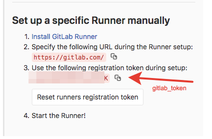
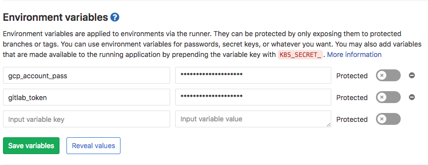
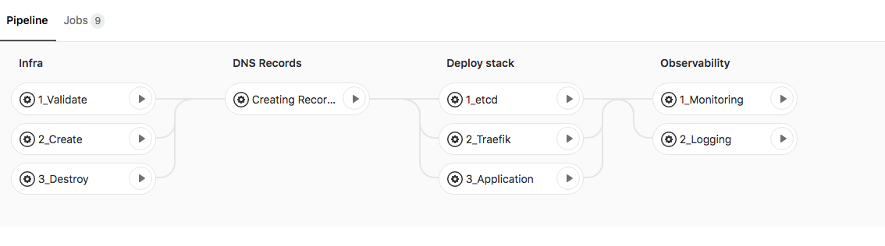
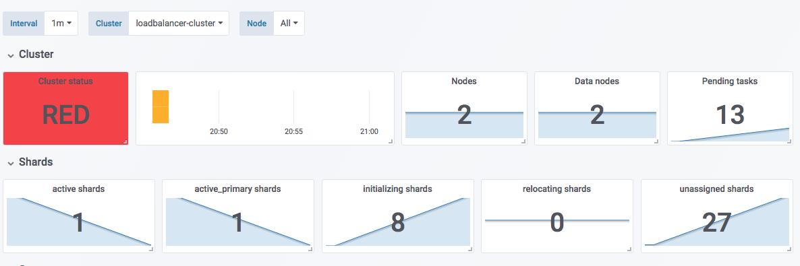

# Automatic Loadbalancer

This project creating infrastructure in Google Cloud Project in deploy into it Demo Application, monitoring and logging systems.

# Quickstart

1. Make fork from current project

2. Replace config files:

* [.env](.env) - main information about your project and authorized information for logging into Grafana service.

* [gcp-service-account](gcp-service-account) - your encoded JSON-file, granted of [Service accounts](https://console.cloud.google.com/iam-admin/serviceaccounts) section of Google Cloud Platform.

For encode your source file `gcp-service-account.json`, run the following command:

Your JSON-file should looking like follow text:
```
{
  "type": "service_account",
  "project_id": "your_project_id",
  "private_key_id": "your_private_key_id",
  "private_key": "your_private_key",
  "client_email": "your_client_email@gserviceaccount.com",
  "client_id": "your_client_id",
  "auth_uri": "https://accounts.google.com/o/oauth2/auth",
  "token_uri": "https://oauth2.googleapis.com/token",
  "auth_provider_x509_cert_url": "https://www.googleapis.com/oauth2/v1/certs",
  "client_x509_cert_url": "https://www.googleapis.com/robot/v1/metadata/x509/****.gserviceaccount.com"
}
```
Encode your file:
```
gcp_account_pass=YOUR_SUPER_PASSWORD
cat gcp-service-account.json | openssl enc -aes-128-cbc -a -salt -pass pass:$gcp_account_pass > gcp-service-account
```

Remember your password. In the future, we will need it.

* [infra/docker-user](infra/docker-user) - your private key for authorization on virtual machines.

* [infra/docker-user.pub](infra/docker-user.pub) - your publik key for authorization on virtual machines.

For creating you keys, run:

```
ssh-keygen
Generating public/private rsa key pair.
Enter file in which to save the key (~/.ssh/id_rsa): docker-user
Enter passphrase (empty for no passphrase):
Enter same passphrase again:
Your identification has been saved in test.
Your public key has been saved in docker-user.pub.
The key's randomart image is:
+---[RSA 2048]----+
|o+oO             |
|.+@.o            |
| oo*+ +          |
|+o=. = -         |
|*. ...+ S        |
|o...o.. +        |
|+. ..+o          |
|=E..+X.          |
|X+  .+.          |
+----[SHA256]-----+
```
If you will see the picture as above, everything is done correctly. Then run:
```
gcp_account_pass=YOUR_SUPER_PASSWORD
cat ~/.ssh/docker-user |  openssl enc -aes-128-cbc -a -salt -pass pass:$gcp_account_pass > docker-user
cp ~/.ssh/docker-user.pub ./infra/docker-user.pub
```
In commands above we are encoding created private key with your password and copying public key.

* [dns_records/group_vars/all.yml](dns_records/group_vars/all.yml) - <i>domain</i>, <i>project_id</i> and <i>service_account_email</i>.

* [infra/variables.tf](infra/variables.tf) - different characteristic of your future infrastructure.

Be sure to replace variable `project` to your google project in Google Gloud Project.

Other settings you can leave the default.

Commit your changes:
```
git commit -m 'my commit text'
```

Now you ready to connect your project to [Gitlab](https://gitlab.com/) CI.

Create new project and choose <b>Imprort Project</b> from Github.


This will allow you your project in GCP. Now, follow to <b>Settings - CI/CD - Runners</b>:



Please, copy token in clipboard and follow to <b>Settings - CI/CD - Environment variables</b>:



Here, you need to set your <b>gitlab-token</b> and previously set variable <b>gcp_account_pass</b>.

In section of your project <b>CI - Pipelines - Your_Pipeline_Id</b> you will see following stages and jobs:



You can run consistently all jobs <b>(without destroy!)</b> for build your infrastructure.

# Сonsider the pipeline jobs in more detail

## 1.1 Validate

Validating terraform project. The project located in `./infra` folder

## 1.2 Create

Creating project in GCP. This job running in shared gitlub-runner and created infrastructure. The list of creating objects:
```
google_compute_firewall.loadbalancer-internal   #opening firewall for internal 
google_compute_firewall.loadbalancer-external   #       and external services

google_compute_address.swarm-mng-int            #internal static ip-addresses
google_compute_address.swarm-wrk-int-01         #       for docker swarm cluster
google_compute_address.swarm-wrk-int-02

google_compute_address.swarm-mng-ext            #external static ip-addresses
google_compute_address.swarm-wrk-ext-01         #       for nodes in docker
google_compute_address.swarm-wrk-ext-02         #       swarm cluster

google_storage_bucket.defaul                    # google storage bucker for saving current state of terraform objects

google_compute_instance.swarm-mng               #virtual machines instances in
google_compute_instance.swarm-wrk-01            #       google compute engine
google_compute_instance.swarm-wrk-02
```

As a result of execution we will have configured docker swarm cluster consisting of 1 master node and 2 workers.

Master node will have started and registered on your project gitlab-runner container with docker executor.

## 1.3 Destroy project

Destroy all your VM instances, firewall rules, and IP-addresses.

## 2. DNS Records

In this section ansible-playbook running in your private gitlab-runner container. It allows us to request ours external IP-address and create necessary dns-records in your Cloud DNS in GCP.

## 3.1. Deploy etcd

Deloying etcd cluster in your docker swarm.


## 3.2. Deploying Træfik

[Traefik](https://traefik.io/) - is a reverse-proxy with automatic discovery of your services.


After deploying traefik, you can open page [http://YOUR_DNS_NAME:8080/dashboard/](http://YOUR_DNS_NAME:8080/dashboard/) and see follow dashboard. While it has no information.

## 3.3. Deploy application

Deploying microservice application. In this project we using [demo of microservices](https://github.com/microservices-demo/microservices-demo):


Page will be allow by address [https://shop.YOUR_DNS_NAME/](https://shop.YOUR_DNS_NAME/). Pay attention, besides of routing to ours demo app, traefik got the valid ssl-certificate using [Let’s Encrypt](https://letsencrypt.org/) service!

## 4.1. Observability - Monitoring

Deploying [Dockerd-Exporter](https://github.com/stefanprodan/caddy-builder), [Cadvisor](https://github.com/google/cadvisor), [Grafana](https://grafana.com/), [Node-Exporter](https://github.com/stefanprodan/swarmprom/tree/master/node-exporter) and [Prometheus](https://prometheus.io/).

Prometheus: [https://prometheus.YOUR_DNS_NAME/](https://prometheus.YOUR_DNS_NAME/)

Grafana: [https://grafana.YOUR_DNS_NAME/](https://grafana.YOUR_DNS_NAME/)


## 4.2. Observability - Logging

Deploying [ELK](https://www.elastic.co/elk-stack) into docker swarm cluster.

We using 2 Elasticsearch nodes for elastic cluster.

Elasticsearch availible through Kibana service: [https://kibana.YOUR_DNS_NAME/](https://kibana.YOUR_DNS_NAME/).

Elastcisearch cluster via Grafana monitoring:




